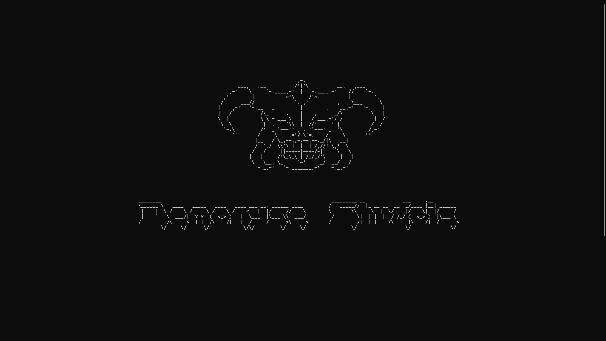

# 🎮 LevelHunter

**LevelHunter** to gra napisana w C++, w której gracz przechodzi przez kolejne poziomy, rozwijając swoją postać i dostosowując wyposażenie.

## 🕹️ Opis gry

Celem gry jest przechodzenie z poziomu na poziom, pokonując wyzwania i rozwijając swój ekwipunek. Każdy kolejny poziom może być trudniejszy i wymaga lepszego przygotowania.

Gra zawiera system ekwipunku (inventory), który pozwala graczowi zarządzać swoim wyposażeniem i dostosowywać styl gry.

## ⚔️ Funkcje

* 🔹 System poziomów (level progression)
* 🎒 Inventory (ekwipunek)
* 🗡️ Różne bronie z unikalnymi umiejętnościami
* 🛡️ Tarcze z różnymi efektami i bonusami
* 🎯 Możliwość zmiany stylu gry poprzez wybór ekwipunku

## 🎮 Gameplay

* Przechodzisz przez kolejne poziomy
* Zbierasz i zmieniasz wyposażenie
* Dostosowujesz strategię dzięki różnym broniom i tarczom
* Każdy wybór wpływa na sposób rozgrywki

## 🧱 Technologie

* Język: **C++**

## 🚀 Jak uruchomić

1. Sklonuj repozytorium:

```bash
git clone https://github.com/BajabongoTS/LevelHunter.git
```

2. Wejdź do folderu projektu:

```bash
cd LevelHunter
```

3. Skompiluj projekt (przykład dla g++):

```bash
g++ main.cpp -o LevelHunter
```

4. Uruchom:

```bash
./LevelHunter
```

*(Dostosuj kompilację jeśli używasz CMake lub innych plików)*

## 📸 Screenshots



## 🛠️ Plany na przyszłość

* 🔸 Więcej poziomów
* 🔸 Nowe bronie i tarcze
* 🔸 System przeciwników
* 🔸 Rozbudowany system umiejętności

## 🤝 Wkład

Pull requesty są mile widziane!
Jeśli masz pomysł na ulepszenie – śmiało twórz issue.

## 📄 Licencja

Ten projekt jest dostępny na licencji MIT (lub innej – jeśli masz).
